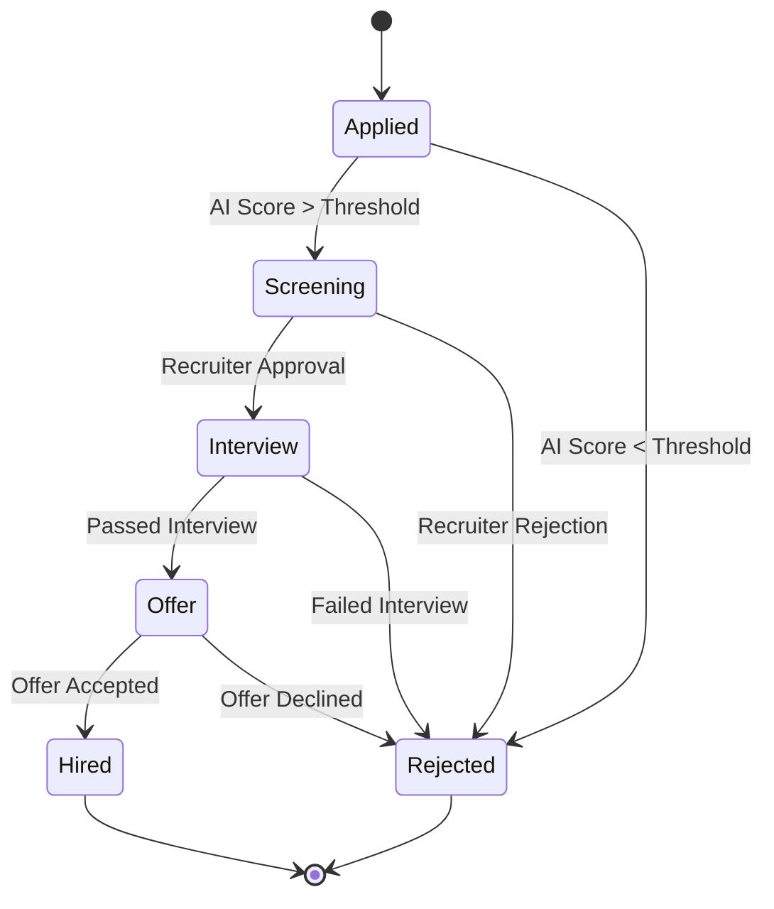
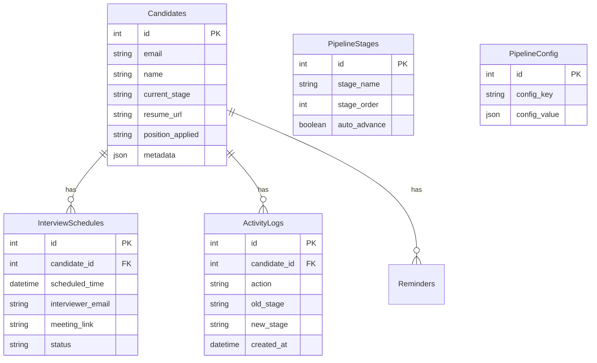

# System Diagrams

## 1. High-Level Architecture
```mermaid
graph TD
    User[Recruiter/HR] -->|Interacts via| FE[Frontend Dashboard (React)]
    Cand[Candidate] -->|Submits CV| Webhook[n8n Webhook]
    
    subgraph "Automation Engine (n8n)"
        Webhook --> CV_Parse[CV Parsing (OpenAI)]
        CV_Parse --> Score[AI Assessment]
        Score --> Filter{Qualified?}
        Filter -->|Yes| Email[Send Interview Invite]
        Filter -->|No| Reject[Send Rejection DB Update]
        Email --> Cal[Google Calendar]
        Cal --> Slack[Slack Notification]
    end

    subgraph "Backend Infrastructure"
        FE -->|REST API| API[Node.js Backend]
        API -->|CRUD| DB[(PostgreSQL Database)]
        n8n[n8n Workflows] -->|Update Status| DB
    end

    subgraph "External Services"
        OpenAI
        Google[Google Workspace]
        SlackService[Slack]
    end

    CV_Parse -.-> OpenAI
    Score -.-> OpenAI
    Email -.-> Google
    Cal -.-> Google
    Slack -.-> SlackService
```

## 2. Recruitment Pipeline Workflow


## 3. Database Schema (ERD)

